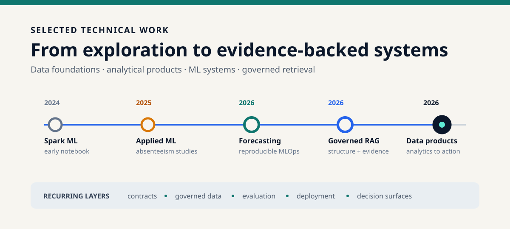
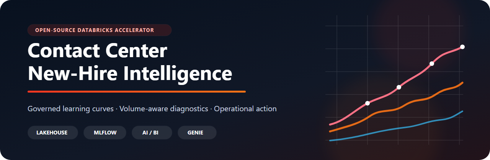
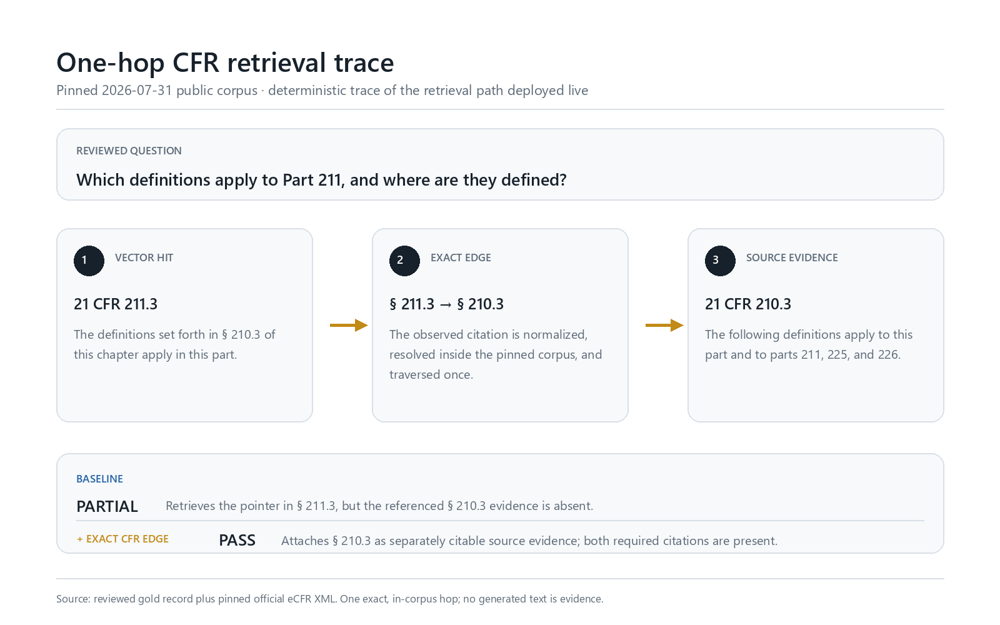
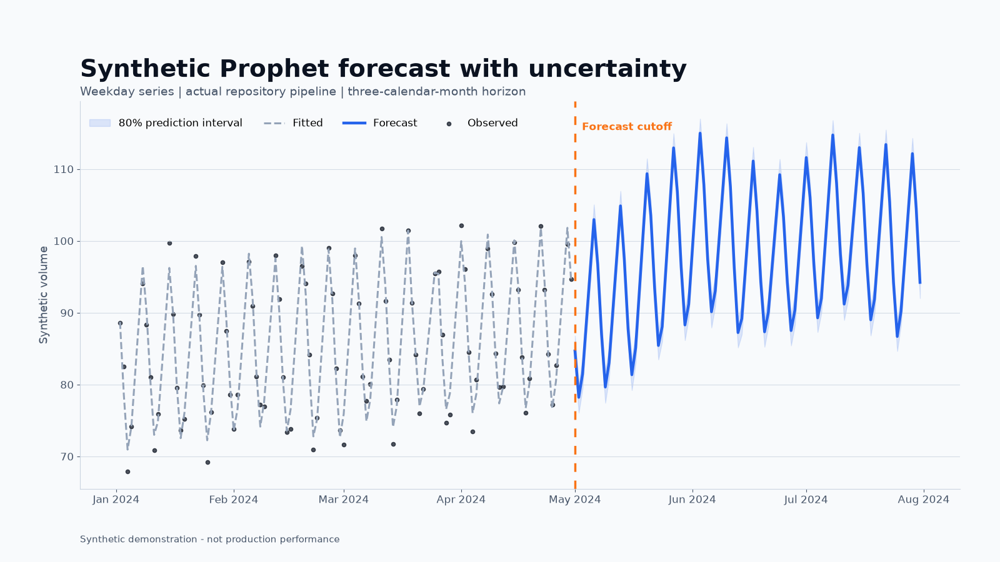
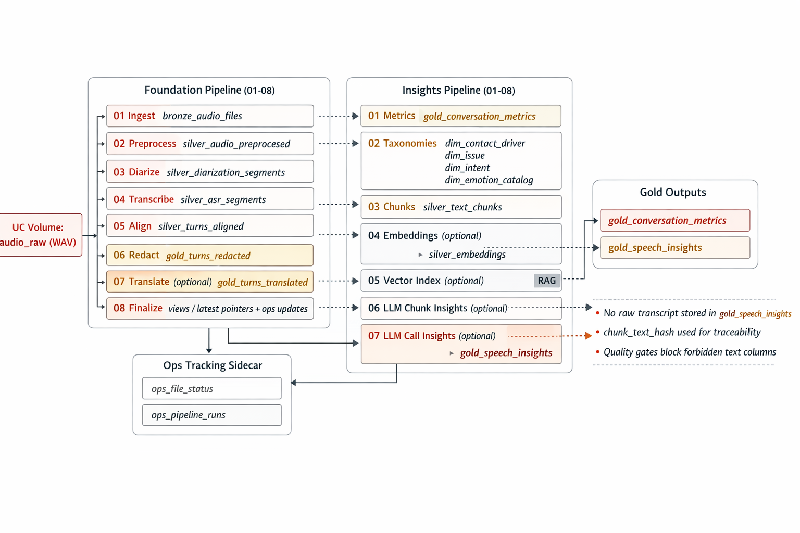

  

# Selected technical work

Projects and open-source work across data, analytics, Databricks, machine-learning systems, and applied AI.

This repository is a guide to the work: what each project explores, how mature it is, what evidence it contains, and where to inspect the implementation.

## Where to start

| If you want to explore... | Start here | Evidence available |
|---|---|---|
| An end-to-end analytics product | [Contact Center New-Hire Intelligence](https://github.com/soulipaco/contact-center-new-hire-intelligence) | Release, CI, tests, live validation record, dashboard captures, walkthrough |
| A retrieval system with a specific technical argument | [Structure-Aware RAG on Databricks](https://github.com/soulipaco/structure-aware-rag-databricks) | Public corpus, 200 tests, CI, evaluation set, live Databricks proof |
| A compact, reproducible MLOps reference | [Prophet Forecasting MLOps](https://github.com/soulipaco/prophet-forecasting-mlops) | Synthetic run, tests, CI, locked environment, regenerable charts |
| Semantic analytics managed as code | [Databricks Genie Deployment Kit](https://github.com/soulipaco/databricks-genie-deployment-kit) | Deployment assets, benchmarks, validators, Olist demo, live dashboard |

## Flagship systems

### Contact Center New-Hire Intelligence

**Released system · Databricks · analytics engineering · forecasting · AI/BI · Genie**

A configurable Databricks accelerator for answering a practical operating question: when is a new-hire cohort becoming production-ready, and what evidence supports the decision?

It turns four governed source tables into learning-curve models, volume-aware diagnostics, forecasts, process-control views, an AI/BI dashboard, a Genie space, and an optional evidence-grounded action workflow. Its strongest quality is the connection between technical implementation and an understandable operational decision.

**Inspect:** [repository](https://github.com/soulipaco/contact-center-new-hire-intelligence) · [case study](projects/contact-center-new-hire-intelligence.md) · [architecture](https://github.com/soulipaco/contact-center-new-hire-intelligence/blob/main/docs/architecture.md) · [validation](https://github.com/soulipaco/contact-center-new-hire-intelligence/blob/main/docs/validation_results.md)

### Structure-Aware RAG on Databricks

**Released reference · document intelligence · governed retrieval · evaluation**

A RAG pipeline built around a focused idea: fixed-window retrieval loses document structure and evidence relationships. The project preserves hierarchy and expands exact, one-hop CFR references as separately citable evidence.

The public demonstration uses date-pinned eCFR material, a committed evaluation set, deterministic local behavior, and live Databricks evidence. It is the strongest example here of a technical claim being made testable.

**Inspect:** [repository](https://github.com/soulipaco/structure-aware-rag-databricks) · [case study](projects/structure-aware-rag-databricks.md) · [evaluation design](https://github.com/soulipaco/structure-aware-rag-databricks/blob/main/docs/evaluation.md) · [retrieval design](https://github.com/soulipaco/structure-aware-rag-databricks/blob/main/docs/retrieval.md)

## Reproducible technical references

### Prophet Forecasting MLOps

**Reproducible reference · forecasting · Python · Optuna · MLflow · Delta**

A batch forecasting reference that keeps forecasting behavior in testable Python and limits Databricks-specific code to delivery, tracking, and persistence boundaries. A seeded synthetic source makes the main contracts reviewable without private data.

The project records four completed synthetic fits, 832 forecast rows, 84 backtest rows, and ten passing local tests. These are execution and contract checks, not claims of production accuracy.

**Inspect:** [repository](https://github.com/soulipaco/prophet-forecasting-mlops) · [case study](projects/prophet-forecasting-mlops.md) · [architecture](https://github.com/soulipaco/prophet-forecasting-mlops/blob/main/docs/architecture.md) · [claims traceability](https://github.com/soulipaco/prophet-forecasting-mlops/blob/main/docs/claims_traceability.md)

### Databricks Genie Deployment Kit

**Supporting reference · semantic analytics · deployment automation · AI/BI**

A version-controlled operating model for Databricks Genie spaces. Room configuration, semantic metadata, SQL examples, benchmark questions, deployment scripts, dashboard guidance, and action playbooks live together as reviewable assets.

The Olist example connects public-data ingestion, governed analytical tables, a Genie space, an eight-page AI/BI dashboard, and RAG-ready operating playbooks. Focused CI now runs the validator, write-free materialization checks, and three repository-contract tests. Durable repository-native dashboard evidence remains pending because the published dashboard is not anonymously accessible.

**Inspect:** [repository](https://github.com/soulipaco/databricks-genie-deployment-kit) · [Olist example](https://github.com/soulipaco/databricks-genie-deployment-kit/tree/main/examples/olist_ecommerce) · [deployment guide](https://github.com/soulipaco/databricks-genie-deployment-kit/blob/main/examples/olist_ecommerce/DEPLOY.md)

## Working prototype

### Speech Analytics Lakehouse

**Prototype · contract-first data engineering · speech analytics · privacy-aware AI**

A 16-stage Databricks design that moves audio through alignment, redaction, optional translation, structured metrics, retrieval assets, and consolidated call insights. The repository's strongest ideas are its explicit data contracts, per-call failure isolation, operational sidecar, and guards against raw transcript text in final analytical outputs.

The implementation now has deterministic compile, workflow, taxonomy, schema-privacy, and synthetic-sample contracts covered by five tests and GitHub Actions. It still has no recorded successful Databricks pipeline execution, so it remains a working prototype rather than a released system.

**Inspect:** [repository](https://github.com/soulipaco/speechanalytics-databricks-pipeline) · [architecture](https://github.com/soulipaco/speechanalytics-databricks-pipeline/blob/main/docs/02_architecture.md) · [security and PII design](https://github.com/soulipaco/speechanalytics-databricks-pipeline/blob/main/docs/05_security_and_pii.md)

## Recurring areas

The projects differ, but several interests repeat:

- **Governed data foundations:** contracts, Delta tables, Unity Catalog, lineage, idempotent runs, and quality gates.
- **Analytical decision surfaces:** dashboards, semantic metadata, benchmark questions, and natural-language analytics.
- **Machine-learning systems:** time-aware forecasting, experiment tracking, evaluation, stable outputs, and deployment bundles.
- **Applied retrieval:** structure-aware chunking, explicit evidence relationships, vector search, RAG, and abstention behavior.
- **Operational trust:** reproducible demos, public-data fixtures, privacy boundaries, scoped claims, and reviewable artifacts.

## Earlier exploration

Earlier repositories remain public because they show how the work developed. They are not presented as equivalent to the systems above.

| Period | Work | How to read it now |
|---|---|---|
| 2024 | [Spark Machine Learning Model Comparison](https://github.com/soulipaco/Spark-Machine-Learning-Model-Comparison) | An early Spark ML notebook exploring loan-default classification and model comparison. |
| 2025 | [Absenteeism Department ML Journey](https://github.com/soulipaco/Absenteeism-Dept-ML-Journey) | Applied feature engineering, time-series analysis, and workforce modeling using confidential source data. |
| 2025 | [Absenteeism Model Testing ML Journey](https://github.com/soulipaco/Absenteeism-Model-Testing-ML-Journey) | Follow-on experimentation with model selection and cross-department evaluation. |

These projects have notebook outputs and reports, but they do not have the reproducible environments, tests, CI, deployment boundaries, or public validation data found in the newer work.

## How this portfolio is maintained

New work is added according to evidence and maturity, not simply recency. A project becomes featured when it adds a distinct problem or technical idea and gives a visitor a clear way to inspect the implementation and proof.

Repository details remain authoritative. This portfolio only summarizes and routes.

---

[GitHub profile](https://github.com/soulipaco) · [LinkedIn](https://www.linkedin.com/in/onur-uslu-10621167/)
